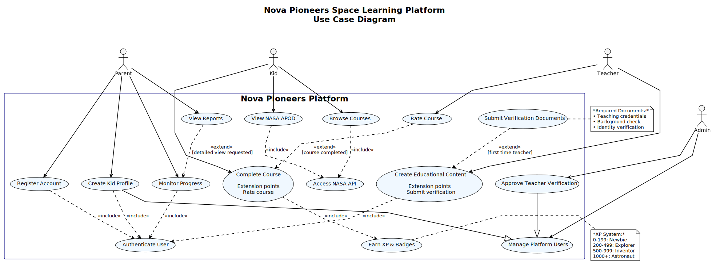
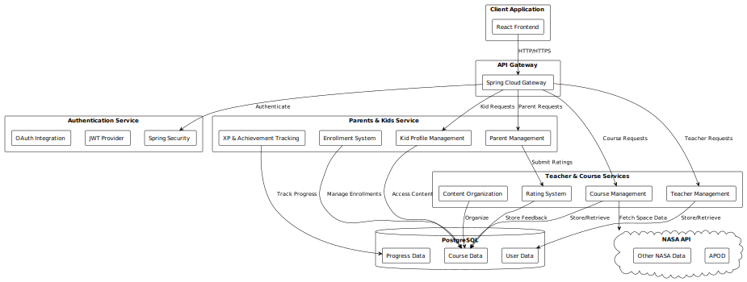
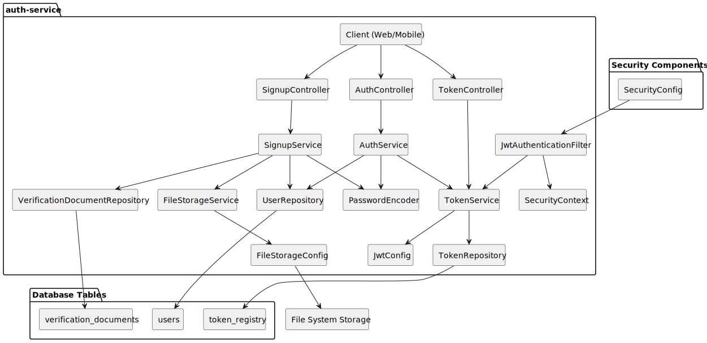
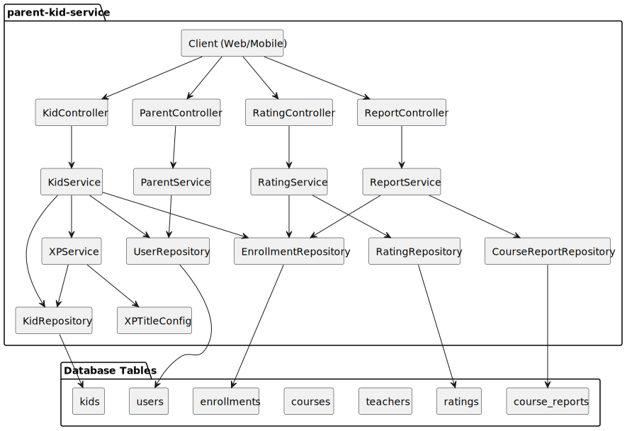
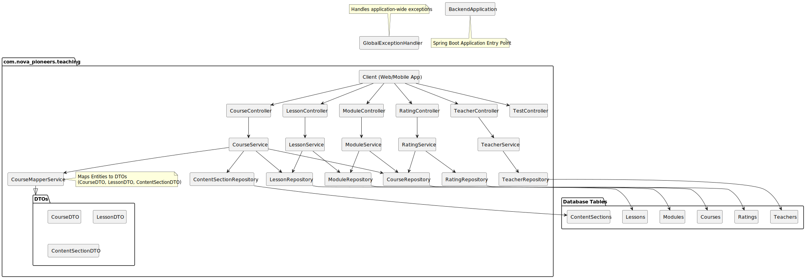

# Nova Pioneers Space Learning Platform - Technical Report

## Table of Contents
- [1. Introduction](#1-introduction)
    - [1.1 Context and Overview](#11-context-and-overview)
    - [1.2 Vision and Mission](#12-vision-and-mission)
    - [1.3 Project Objectives](#13-project-objectives)
- [2. Platform Overview](#2-platform-overview)
    - [2.1 Key Features](#21-key-features)
    - [2.2 User Personas](#22-user-personas)
- [3. System Architecture](#3-system-architecture)
    - [3.1 High-Level Architecture](#31-high-level-architecture)
    - [3.2 Microservices Breakdown](#32-microservices-breakdown)
        - [API Gateway](#api-gateway)
        - [Auth Service](#auth-service)
        - [Parents-Kids Service](#parents-kids-service)
        - [Teachers/Courses Service](#teacherscourses-service)
    - [3.3 Database Schema](#33-database-schema)
    - [3.4 Frontend Architecture](#34-frontend-architecture)
- [4. Technology Stack](#4-technology-stack)
    - [4.1 Backend Technologies](#41-backend-technologies)
    - [4.2 Frontend Technologies](#42-frontend-technologies)
    - [4.3 DevOps Tools](#43-devops-tools)
    - [4.4 External APIs](#44-external-apis)
- [5. Collaboration and Development Process](#5-collaboration-and-development-process)
    - [5.1 Development Workflow](#51-development-workflow)
    - [5.2 Code Quality Measures](#52-code-quality-measures)

## 1. Introduction

### 1.1 Context and Overview
Nova Pioneers is a web-based learning platform designed for young learners interested in space exploration. The platform provides age-appropriate educational content about space, leveraging NASA APIs to deliver real-time space-related information in an engaging format for children. The target audience is school-age children, with content tailored for different age groups.

### 1.2 Vision and Mission
Our mission is to democratize space education and inspire the next generation of astronomers, astrophysicists, and space enthusiasts. We believe that understanding our universe is the first step toward protecting our planet and expanding human knowledge. The platform aims to create a global community of young learners united by curiosity about the cosmos.

### 1.3 Project Objectives
- Create an engaging, kid-friendly interface for space education
- Implement a secure microservices architecture with distinct responsibility domains
- Build an XP-based progress tracking system to motivate learning
- Enable educators to contribute content with appropriate review mechanisms
- Provide parents with oversight of their children's learning progress

### 1.4 Use Case Diagram

## 2. Platform Overview

### 2.1 Key Features
- Kid-friendly interface with space-themed design
- Real-time space content integration via NASA APIs
- XP-based achievement system with badges and rewards
- Teacher content contribution and verification workflow
- Parent dashboard for monitoring child progress
- Course rating system with age-appropriate feedback mechanisms

### 2.2 User Personas
- **Kids**: Primary learners accessing educational content
- **Parents**: Monitor children's progress and manage accounts
- **Teachers**: Create and contribute educational content
- **Administrators**: Manage platform operations and content approval

## 3. System Architecture

### 3.1 High-Level Architecture

The platform employs a microservices architecture with distinct services handling specific functionality domains. The architecture diagram (Report/images/overview.png) illustrates the high-level component interactions.

### 3.2 Microservices Breakdown

[//]: # (#### API Gateway)

[//]: # (The API Gateway serves as the single entry point for all client requests, handling routing, load balancing, and security filters. It uses Spring Cloud Gateway to direct traffic to appropriate microservices based on URL paths.)

[//]: # (![API Gateway Architecture]&#40;Report/images/gateway.svg&#41;)

[//]: # ()
[//]: # (Key components:)

[//]: # (- Route predicate factory for path-based service routing)

[//]: # (- JWT authentication filter for token validation)

[//]: # (- CORS filter for cross-origin requests)

[//]: # (- Rate limiting for preventing abuse)

[//]: # ()
[//]: # (#### Auth Service)

[//]: # (The authentication service manages user registration, login, and security token management. It handles both parent and teacher registration flows, including document verification for teachers.)

Key components:
- User registration (separate flows for parents and teachers)
- Password encryption and authentication
- JWT token generation and validation
- Document storage for teacher verification

#### Parents-Kids Service
This microservice manages parent-child relationships and learning progression on the platform.

## Core Responsibilities
- Parent/kid profile management
- Course enrollment and progress tracking
- Rating and reporting system
- XP accumulation and achievement titles

## Key Flows

### Profile Management
- Create and link kid accounts to parent profiles
- Update user information and preferences
- Manage account restrictions and permissions

### Learning Progression
- Track course completion percentage and milestones
- Award XP based on completed activities
- Assign achievement titles based on accumulated XP

| XP Range | Title     |
|----------|-----------|
| 0-199    | Newbie    |
| 200-499  | Explorer  |
| 500-999  | Inventor  |
| 1000+    | Astronaut |

### Feedback System
- Submit and retrieve course ratings (1-5 scale)
- Process course reports from teachers
- Generate progress summaries for parents

### Database Interactions
- Primary tables: users, kids, enrollments, progress_logs
- Secondary tables: course_ratings, course_reports, xp_titles

#### Teachers/Courses Service
The teaching service handles course creation, management, and organization by educators. It supports structured learning content with modular organization.

Key components:
1.	Teacher Management
      o	Create and manage teacher profiles
      o	Track teacher certification information
      o	Upgrade teacher titles based on accumulated XP
      o	Manage teacher credentials and verification
2.	Course Management
      o	Create and manage educational courses about space and exploration
      o	Organize content into modules, lessons, and content sections
      o	Define XP values based on course size and complexity
      o	Target content to appropriate age groups and grade levels
      o	Support for ratings and feedback on courses

### 3.3 Database Schema

The database uses a normalized PostgreSQL schema optimized for educational content delivery and progress tracking. Key entities include:

- **Users**: Central user table with role-based access control
- **Verification Documents**: For teacher credential verification
- **Kids**: Child profiles linked to parent accounts
- **Courses**: Educational content organized by categories
- **Enrollments**: Tracks kid enrollment in courses
- **Progress Logs**: Detailed learning activity records
- **Course Ratings**: Feedback mechanism for content quality

### 3.4 Frontend Architecture

The frontend is built with React and employs a component-based architecture with Tailwind CSS for styling and Framer Motion for animations.

Key components:
- Landing page with NASA API integration
- User authentication forms
- Role-specific dashboards
- Course browsing and viewing interface
- Interactive learning components

## 4. Technology Stack

### 4.1 Backend Technologies
- **Java 21** with Spring Boot 3.4.x
- **Spring Security** for authentication
- **Spring Data JPA** for data access
- **PostgreSQL** for data persistence
- **Spring Cloud Gateway** for API routing

### 4.2 Frontend Technologies
- **React 19** for UI components
- **Tailwind CSS 4** for styling
- **Framer Motion** for animations
- **React Router** for client-side routing
- **Vite** for frontend build and development

### 4.3 DevOps Tools
- **Docker**: Used for containerization.
- **Docker Compose**: Used for multi-container orchestration.
- **Maven**: Used for Java dependency management and build automation.
- **npm**: Used for JavaScript dependency management.
- **Ansible**: Used to prepare the Oracle Cloud Infrastructure virtual machine for deployment.
- **Prometheus and Grafana**: Used for monitoring.
- **GitHub Actions**: Used for CI/CD pipelines.

### 4.4 External APIs
- **NASA APIs**: Integration with Astronomy Picture of the Day (APOD) and other space data sources

## 5. Collaboration and Development Process

### 5.1 Development Workflow
The project employs a feature-branch Git workflow with code reviews before merging to the main branch. The microservices architecture allows for parallel development across different system components.

